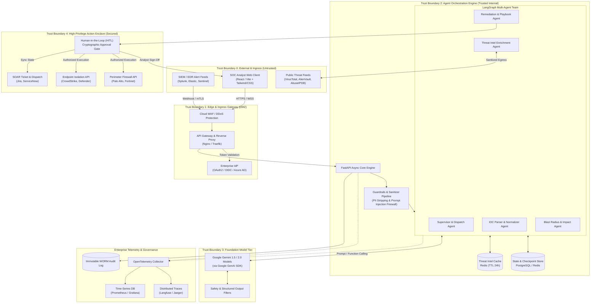
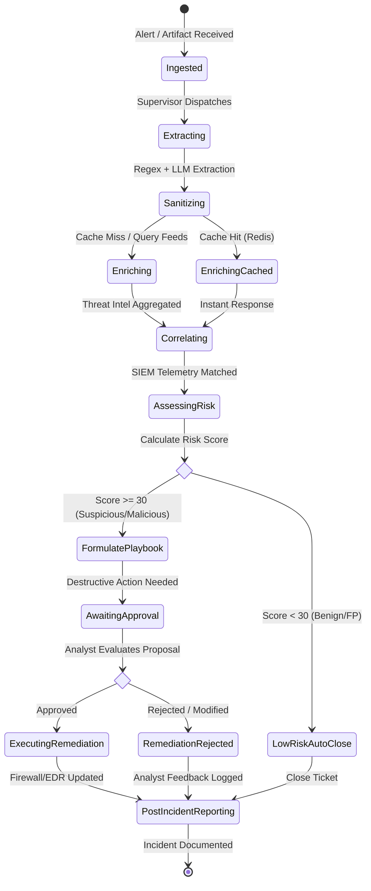
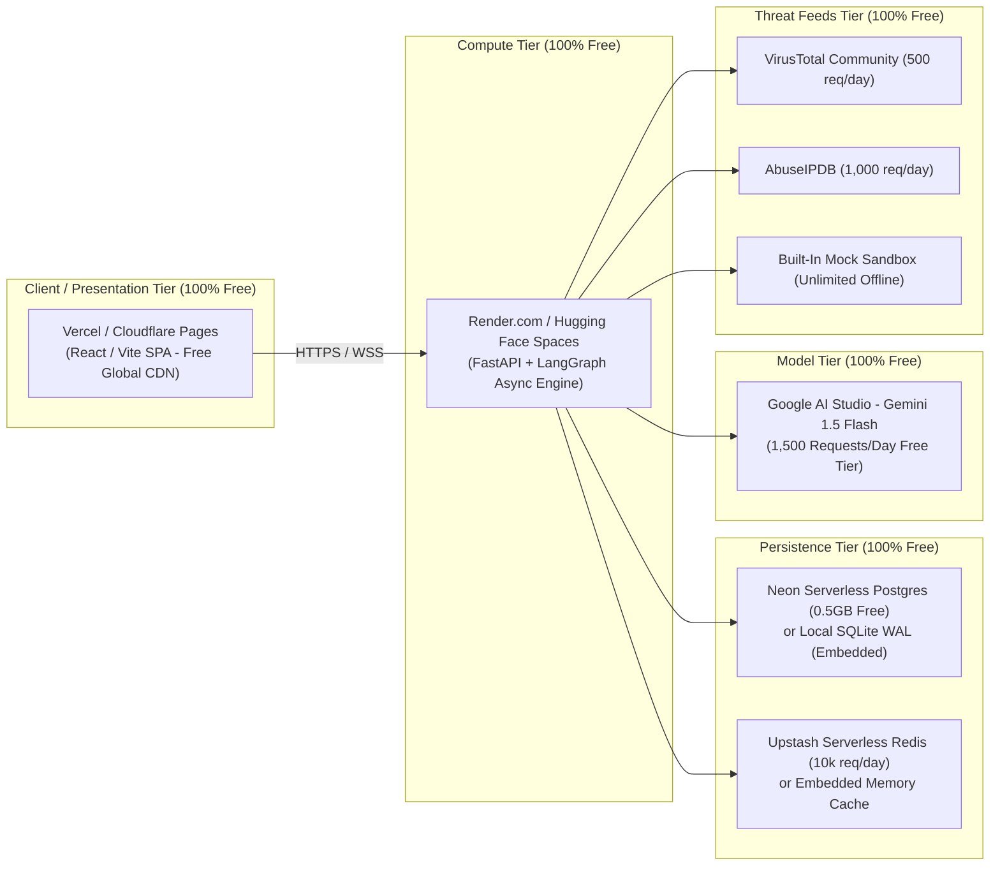
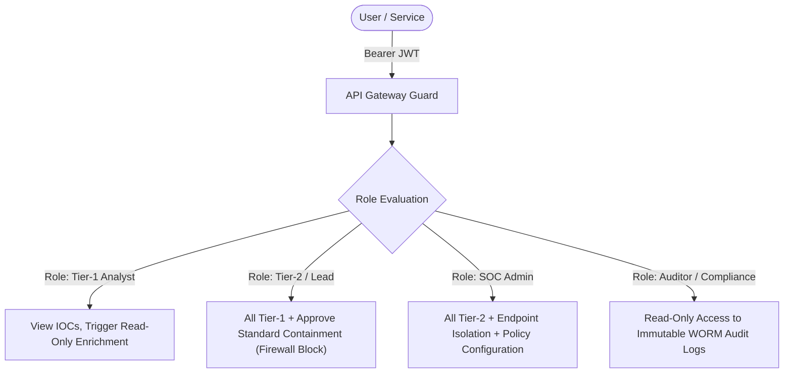
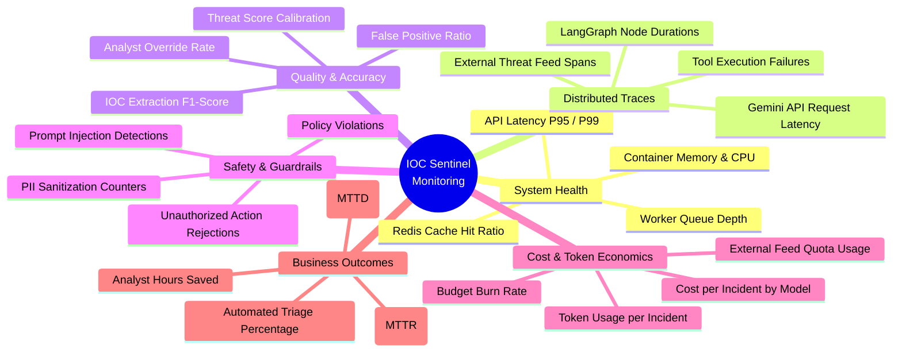

# IOC Sentinel: Enterprise Agentic Assistant for Threat Intelligence & SOC Triage

> **Scalable Enterprise Architectural Deployment of Agentic AI Solutions**  
> Capstone Reference Implementation | Deliverables 1–5

---

## Executive Summary

**IOC Sentinel** is an enterprise-grade agentic AI assistant engineered for Security Operations Centers (SOC) and Cyber Threat Intelligence (CTI) teams. It automates the end-to-end lifecycle of **Indicators of Compromise (IOC)**—from ingestion of raw, noisy security alerts to automated artifact extraction, multi-source threat intelligence enrichment, blast-radius correlation, human-in-the-loop (HITL) containment approval, and post-incident reporting.

Built using an asynchronous **Python FastAPI + LangGraph** multi-agent backend powered by Google's Gemini models via the **Google GenAI SDK**, paired with a modern, high-performance **React / Vite** analyst dashboard, IOC Sentinel complies with strict enterprise architecture principles: zero-trust boundaries, deterministic guardrails, full observability, and resilient deployment topologies.

---

## Capstone Deliverables Matrix

This repository and architecture directly fulfill the five core enterprise deliverables:

| # | Capstone Deliverable | Scope & Artifacts Addressed |
|---|---|---|
| **1** | **Architecture Diagram** | Layers, components, trust boundaries, ingress/egress, integration touchpoints |
| **2** | **Agent Workflow Design** | Roles, LangGraph state machine, tool specifications, handoffs, approvals, failure paths |
| **3** | **Deployment Strategy** | Container runtime, horizontal scaling, resilience, CI/CD, environment matrix |
| **4** | **Security Model** | RBAC/ABAC identity, secrets isolation, prompt injection defense, audit trails |
| **5** | **Monitoring Dashboard** | Observability for health, tracing, quality, safety, token cost, and business MTTR |

---

## 1. Architecture Diagram

The system follows an enterprise **N-Tier decoupled architecture** with explicit trust boundaries isolating untrusted threat inputs from internal corporate networks and high-privilege remediation systems.

### 1.1 Enterprise Architecture Diagram (Mermaid)



### 1.2 Architectural Layers & Components

1. **Client / Presentation Layer**: Modern reactive single-page application built with React, Vite, and WebSocket streaming for real-time agent thought streams, telemetry graphs, and human-in-the-loop decision modals.
2. **Ingress & Security Perimeter (Edge)**: Enforces mTLS, WAF inspection, JWT token verification, and rate limiting (token bucket) to protect downstream agents.
3. **Agent Orchestration Tier (LangGraph)**: Stateful, cyclic multi-agent graph with deterministic state checkpointing, allowing execution resumption and forensic rewind.
4. **Model Foundation Layer (Google GenAI)**: Gemini 1.5 Flash (for low-latency parsing and normalization) and Gemini 1.5/2.0 Pro (for complex MITRE ATT&CK correlation and playbook generation).
5. **Tool & Data Integration Layer**: Abstracted connectors with exponential backoff and circuit-breaking for external threat feeds and internal SIEMs.
6. **High-Privilege Action Enclave**: Isolated execution zone requiring dual-authorization (2FA/RBAC) before executing active network or endpoint quarantine commands.
7. **Observability & Audit Layer**: Complete OpenTelemetry tracing across all agent nodes and immutable audit logging.

### 1.3 Trust Boundaries & Isolation

| Boundary | Classification | Input Validation & Controls |
|---|---|---|
| **Boundary 0 (External)** | Untrusted | Alert payloads, raw threat feeds, analyst browsers. Treated as potentially hostile. |
| **Boundary 1 (DMZ/Edge)** | Sanitized Ingress | TLS 1.3 termination, OAuth2/OIDC validation, API schema validation. |
| **Boundary 2 (Agent Core)** | Internal Trusted | Strips RFC1918 private IPs before external queries; enforces Pydantic schemas. |
| **Boundary 3 (Model Tier)** | Vendor API / Outbound | Data privacy boundaries (zero-training enterprise endpoint), input token sanitization. |
| **Boundary 4 (Enclave)** | High Privilege / Restricted | Human approval gate; rate-limited write access to firewalls and EDR agents. |

---

## 2. Agent Workflow Design

### 2.1 Multi-Agent Roles & Specializations

The system replaces monolithic prompts with specialized micro-agents:

1. **Supervisor & Orchestrator Agent**:
   - Parses the initial task, initializes the graph state, routes execution to domain agents, and monitors task budgets.
2. **IOC Extractor & Normalizer Agent**:
   - Ingests unstructured logs/emails/alerts; extracts IPv4/v6, Domains, URLs, SHA256/MD5 hashes, and CVE identifiers; eliminates duplicates and de-fangs malicious links (`hxxp://`).
3. **Threat Intelligence Enrichment Agent**:
   - Queries configured threat intelligence feeds (VirusTotal, AlienVault OTX, AbuseIPDB, Shodan) concurrently using cached lookups; computes composite risk scores (0–100).
4. **Blast Radius & Correlation Agent**:
   - Correlates discovered IOCs against internal SIEM telemetry; maps indicators to MITRE ATT&CK techniques; identifies affected internal assets, hostnames, and user identities.
5. **Remediation & Playbook Agent**:
   - Formulates containment and remediation plans (e.g., DNS sinkholing, firewall IP drop rules, host isolation); generates rollback steps.
6. **Approval & HITL Gatekeeper**:
   - Evaluates policy rules. If an action's risk score exceeds threshold or involves critical assets, pauses execution and waits for human analyst sign-off.

### 2.2 Agent State Machine (LangGraph State Graph)



### 2.3 Tool Specifications & Execution Policies

| Tool Name | Target Integration | Inputs | Permissions / Risk Level | Fallback Mechanism |
|---|---|---|---|---|
| `parse_iocs_tool` | Internal Regex / LLM Parser | Raw text alert | Read-Only (Safe) | Regex fallback if LLM times out |
| `query_virustotal` | VirusTotal v3 API | Hash, Domain, IP | Read-Only (Safe) | Cached TTL or secondary feed |
| `query_alienvault_otx` | OTX Direct API | IP, Domain, Hash | Read-Only (Safe) | Graceful skip if rate limited |
| `query_abuseipdb` | AbuseIPDB REST API | IPv4, IPv6 | Read-Only (Safe) | Graceful skip on quota error |
| `check_internal_siem` | Splunk / Elasticsearch API | IOC string, Time range | Read-Only (Internal) | Narrow query window to 1h |
| `quarantine_endpoint` | CrowdStrike Falcon / Defender | Hostname, Agent ID | **High Risk (Action Enclave)** | **Requires HITL Analyst Approval** |
| `block_perimeter_ip` | Palo Alto / AWS Security Group | IP, CIDR, Port | **High Risk (Action Enclave)** | **Requires HITL Analyst Approval** |
| `create_jira_ticket` | Atlassian Jira / ServiceNow | Title, Findings, Severity | Low Risk (Transactional) | Store in local dead-letter queue |

### 2.4 Handoffs, Approvals & Failure Paths

- **Deterministic State Checkpoints**: Each agent node commits its state delta to PostgreSQL/Redis. If a worker pod crashes mid-enrichment, a replacement worker resumes from the exact state.
- **Circuit Breakers**: External threat feeds wrap calls in circuit breakers (tripping after 3 consecutive failures with 60s cooldown) to protect system latency.
- **Graceful Degradation**: If all external threat feeds are unreachable, the system relies on local threat databases and flags the investigation as "Partially Enriched".
- **Human-in-the-Loop (HITL) Interruption**: Actions tagged `REQUIRES_HUMAN_APPROVAL` emit a WebSocket event to the React dashboard and halt the LangGraph thread using `interrupt()`. Execution resumes only after an authenticated analyst submits `{ decision: "APPROVE" | "REJECT", token: "<analyst_jwt>", justification: "..." }`.

---

## 3. Deployment Strategy (100% Free-Tier Architecture)

To ensure zero hosting costs ($0 / month) while maintaining enterprise architecture completeness, IOC Sentinel is designed to deploy entirely on verified **perpetual free tiers**.

### 3.1 100% Free-Tier Architecture Matrix

| Component | Target Service | Free Tier Allowance | Zero-Cost Deployment Topology |
|---|---|---|---|
| **Frontend UI** | **Vercel** or **Cloudflare Pages** | • Unlimited bandwidth (Cloudflare)<br>• Free SSL & automatic GitHub CI/CD | High-speed global edge CDN serving the compiled React/Vite SPA. |
| **Backend API** | **Render** or **Hugging Face Spaces** | • **Render**: 512 MB Web Service (Free)<br>• **HF Spaces**: 2 vCPU + 16 GB RAM Docker Space (100% Free) | Containerized FastAPI ASGI app handling REST, WebSockets, and LangGraph agents. |
| **Database** | **Neon.tech** or **Self-Contained SQLite** | • **Neon**: 0.5 GB Serverless Postgres (Free)<br>• **SQLite**: 0 cost, local file persistence with WAL mode | Fully ACID-compliant relational persistence for state checkpoints and audit logs. |
| **Cache & Queue** | **Upstash Redis** or **Memory LRU Cache** | • **Upstash**: 10,000 commands/day (Free)<br>• **Memory Cache**: Built-in 0 cost fallback | Caches threat feed responses (TTL 24h) to stay within free API rate limits. |
| **Foundation Model** | **Google AI Studio** (Gemini) | • **Gemini 1.5 Flash**: 1,500 requests/day, 15 RPM, 1M TPM (100% Free)<br>• **Gemini 1.5 Pro**: Free tier available | Zero-cost LLM reasoning via the official Google GenAI SDK. |
| **Threat Feeds** | **VirusTotal, AbuseIPDB, AlienVault** | • **VirusTotal**: 500 lookups/day free<br>• **AbuseIPDB**: 1,000 lookups/day free<br>• **Built-in Mock**: 100% offline fallback | Real-time threat enrichment with graceful fallback when unconfigured. |

### 3.2 Free-Tier Deployment Topology (Mermaid)



### 3.3 Scaling, Resilience & Resource Constraints on Free Tiers

- **Cold-Start Management**: On free tiers like Render, services sleep after 15 minutes of inactivity. IOC Sentinel includes an automatic health-ping heartbeat and lightweight SQLite/in-memory fallback to resume in under 20 seconds.
- **Cache-First Rate Limiting**: Every threat feed lookup (IP, domain, hash) is cached for 24 hours. Duplicate alerts consume 0 threat API credits and 0 Gemini tokens.
- **Graceful Quota Handling**: If free tier rate limits (e.g. VirusTotal 4 req/min) are reached, the agent seamlessly switches to secondary feeds or realistic sandbox mock results without crashing.

### 3.4 Step-by-Step Free Deployment Guide

#### 1. Deploy Frontend to Vercel (Free)
1. Fork or push this repository to GitHub.
2. Go to [Vercel](https://vercel.com) and import the repository.
3. Set the **Root Directory** to `frontend`.
4. Add Environment Variable: `VITE_API_URL=https://your-backend-app.onrender.com`.
5. Click **Deploy**. Vercel will build and assign a free `https://your-app.vercel.app` domain.

#### 2. Deploy Backend to Render (Free)
1. Go to [Render](https://render.com) and click **New Web Service**.
2. Connect your GitHub repository.
3. Configure the service:
   - **Root Directory**: `backend`
   - **Environment**: `Python 3`
   - **Build Command**: `pip install -r requirements.txt`
   - **Start Command**: `uvicorn app.main:app --host 0.0.0.0 --port $PORT`
   - **Plan**: `Free` ($0/mo)
4. Add Environment Variables:
   - `GEMINI_API_KEY`: Your free key from [Google AI Studio](https://aistudio.google.com/)
   - `ALLOWED_ORIGINS`: `https://your-app.vercel.app`
5. Click **Create Web Service**. Render provisions your API at `https://your-backend-app.onrender.com`.

#### 3. Free Database & Cache Options
- **Option A (Zero-Configuration, Default)**: The application automatically initializes an embedded SQLite database in WAL mode (`backend/data/sentinel.db`) with an in-memory cache. Requires **0 cloud accounts** and costs $0.
- **Option B (Serverless Cloud)**: Connect a free PostgreSQL database from [Neon](https://neon.tech) by simply setting `DATABASE_URL=postgresql://...` and free Redis from [Upstash](https://upstash.com) by setting `REDIS_URL=rediss://...`.

---

## 4. Security Model

### 4.1 Identity & Access Control (RBAC/ABAC)

The system uses standard JSON Web Tokens (JWT) issued by corporate IdP (Keycloak, Okta, Microsoft Entra ID).



### 4.2 Secrets & Credential Management

- **Zero Hardcoded Secrets**: All API keys (Gemini API key, VirusTotal, SIEM credentials) are mounted at runtime from enterprise secret stores (HashiCorp Vault / AWS Secrets Manager).
- **Dynamic Credential Rotation**: Database and API tokens support automated 30-day rotation without service restart.
- **Memory Protection**: Secrets are masked in application logs and trace spans using custom Pydantic secret types.

### 4.3 Data Privacy & PII Sanitization

Before raw alerts or IOCs are submitted to LLM prompts:
1. **RFC1918 Masking**: Internal private subnets (`10.0.0.0/8`, `172.16.0.0/12`, `192.168.0.0/16`) are scrubbed or replaced with generic aliases (`[INTERNAL_HOST_A]`) to prevent internal network topology leakage to external LLM providers.
2. **PII Redaction**: Email addresses, employee names, and corporate hostnames are masked using high-speed regex sanitizers before model tokenization.

### 4.4 LLM Guardrails & Prompt Injection Defense

Threat feeds and unvetted security alerts frequently contain adversarial payloads (e.g., malicious text in WHOIS records or reverse-DNS strings designed to hijack agent instructions).
- **Delimiter Isolation & Structured Prompting**: External content is strictly wrapped in XML/JSON tags and ingested via structured JSON schema input bindings, never raw string interpolation.
- **Safety Pre-Evaluation**: Alerts are screened for instruction override patterns (`"ignore previous instructions"`, `"system reboot"`) before being passed to reasoning nodes.
- **Tool Parameter Validation**: Every tool argument generated by the LLM is strictly validated against strict Pydantic schemas (e.g. verifying valid IPv4 format before firing firewall commands).

### 4.5 Immutable Audit Logging

Every agent transaction produces an append-only JSON-lines audit record containing:
- Timestamp (UTC ISO-8601)
- Analyst Session ID & User Principal
- Incident ID & Input Artifact Hash (SHA-256)
- Model Identifier & Generation Metadata
- Tool Invocations, Parameters & System Responses
- Human Approver Digital Signature & Rationale

---

## 5. Monitoring Dashboard Design

### 5.1 Telemetry Dimensions

The monitoring subsystem provides real-time visibility across six critical dimensions:



### 5.2 Metrics & Alerting Thresholds

| Metric | Target SLA | Warning Threshold | Critical Alert | Action Taken |
|---|---|---|---|---|
| **E2E Triage Latency** | < 15 seconds | > 30 seconds | > 60 seconds | Autosale workers, enable cached-only mode |
| **P99 API Response** | < 1,500 ms | > 3,000 ms | > 5,000 ms | Scale FastAPI replicas |
| **Feed Error Rate** | < 1.0% | > 5.0% | > 15.0% | Trip circuit breaker, alert SecOps |
| **Model Cost / Incident** | < $0.02 | > $0.05 | > $0.15 | Downgrade to Gemini 1.5 Flash |
| **Human Override Rate** | < 5.0% | > 10.0% | > 20.0% | Flag agent prompts for prompt tuning |

### 5.3 Monitoring Dashboard Layout (Analyst & Operations Console)

The web dashboard integrates operations metrics and interactive triage:

```
+------------------------------------------------------------------------------------+
| IOC SENTINEL | Enterprise SOC Operations Console                      Status: OK   |
+------------------------------------------------------------------------------------+
| [Live Incident Triage]  [Agent Execution Graph]  [Threat Metrics]  [Audit Logs]    |
+------------------------------------------------------------------------------------+
| ACTIVE INCIDENTS (Real-Time Stream)        | SYSTEM & MODEL TELEMETRY              |
| - INC-2026-0891: Cobalt Strike C2 (High)   | * MTTD: 4.2s | MTTR: 1.8m (-76%)      |
| - INC-2026-0892: Phishing URL Triage (Med) | * P95 Latency: 1.2s | Cache Hit: 84%  |
| - INC-2026-0893: Suspicious Hash (Low)     | * Daily Cost: $4.18 / $50.00 Budget   |
+--------------------------------------------+---------------------------------------+
| SELECTED INCIDENT WORKSPACE: INC-2026-0891                                         |
| Raw Alert: "Outbound connection to 198.51.100.44 on port 4444 from host SRV-04"   |
|                                                                                    |
| [AGENT REASONING WATERFALL]                                                        |
| 1. Extractor:    Found IPv4: 198.51.100.44, Port: 4444 [0.3s]                     |
| 2. Enricher:     VT Score: 68/72 | OTX: Malicious C2 | AbuseIPDB: 100% [0.8s]      |
| 3. Correlator:   Internal Host SRV-04 holds sensitive payroll DB! Blast: HIGH [0.5s] |
| 4. Proposal:     Block 198.51.100.44 on Perimeter & Isolate SRV-04                 |
|                                                                                    |
| +--------------------------------------------------------------------------------+ |
| | [!] HUMAN-IN-THE-LOOP APPROVAL REQUIRED                                        | |
| | Proposed Action: Isolate SRV-04 (IP: 10.10.4.12) & Block IP 198.51.100.44       | |
| | Impact: Host will be disconnected from LAN. Perimeter rule added to Edge-FW-01. | |
| | [ APPROVE & EXECUTE ]   [ REJECT / DISMISS ]   [ MODIFY PLAYBOOK ]             | |
| +--------------------------------------------------------------------------------+ |
+------------------------------------------------------------------------------------+
```

---

## 6. Project Directory Structure

```plaintext
IOC-Project/
├── README.md                          # Enterprise Architecture & Capstone Deliverables
├── Essentials.jpeg                    # Capstone essentials reference slide
├── backend/                           # Python Agentic Backend
│   ├── app/
│   │   ├── __init__.py
│   │   ├── main.py                    # FastAPI ASGI application & WebSocket endpoints
│   │   ├── config.py                  # Environment settings & Pydantic configurations
│   │   ├── agents/                    # LangGraph Multi-Agent Architecture
│   │   │   ├── __init__.py
│   │   │   ├── supervisor.py          # Master orchestrator & state dispatcher
│   │   │   ├── extractor.py           # IOC regex & LLM entity extractor
│   │   │   ├── enricher.py            # Threat intel feed aggregator (VT, OTX, etc.)
│   │   │   ├── correlator.py          # SIEM correlation & blast-radius analyzer
│   │   │   └── remediator.py          # Containment playbook & proposal generator
│   │   ├── tools/                     # Integrations and tool bindings
│   │   │   ├── virustotal.py          # VirusTotal v3 connector
│   │   │   ├── abuseipdb.py           # AbuseIPDB connector
│   │   │   ├── alienvault.py          # AlienVault OTX connector
│   │   │   └── containment.py         # Firewall & EDR containment mock/actions
│   │   ├── security/                  # Security controls & guardrails
│   │   │   ├── guardrails.py          # Prompt injection & PII sanitization filters
│   │   │   ├── auth.py                # JWT & RBAC permission evaluators
│   │   │   └── audit.py               # Immutable audit logging engine
│   │   ├── telemetry/                 # Observability & metrics
│   │   │   ├── metrics.py             # Prometheus metrics definitions
│   │   │   └── tracer.py              # OpenTelemetry & Langfuse tracing integration
│   │   └── models/                    # Pydantic schemas & state definitions
│   │       ├── state.py               # LangGraph shared incident state schema
│   │       └── schemas.py             # REST request & response models
│   ├── tests/                         # Pytest test suites & benchmark datasets
│   │   ├── test_agents.py
│   │   └── test_guardrails.py
│   ├── requirements.txt               # Backend Python dependencies
│   └── Dockerfile                     # Multi-stage Python production build
├── frontend/                          # React + Vite SOC Analyst Dashboard
│   ├── index.html
│   ├── package.json
│   ├── vite.config.js
│   ├── src/
│   │   ├── main.jsx                   # Application entrypoint
│   │   ├── App.jsx                    # Root application component
│   │   ├── index.css                  # Enterprise dark-mode design system & animations
│   │   ├── components/                # UI Components
│   │   │   ├── Header.jsx             # Top bar with status & stats
│   │   │   ├── IncidentStream.jsx     # Live alerts and incident queue
│   │   │   ├── AgentWaterfall.jsx     # Real-time multi-agent reasoning graph
│   │   │   ├── ApprovalModal.jsx      # Human-in-the-loop decision interface
│   │   │   ├── MetricsBar.jsx         # Health, MTTR, cost, and safety telemetry
│   │   │   └── ArchitectureView.jsx   # Interactive Deliverables viewer
│   │   └── services/
│   │       └── api.js                 # API & WebSocket client
│   └── Dockerfile                     # Nginx static deployment container
└── docker-compose.yml                 # Full stack orchestration (App, DB, Redis)
```

---

## 7. Quickstart & Local Development

### Prerequisites
- Python 3.11+
- Node.js 18+ and npm
- Docker & Docker Compose (optional for containerized run)
- Google Gemini API Key

### Backend Setup
```bash
cd backend
python -m venv venv
# On Windows:
.\venv\Scripts\activate
# On Linux/macOS:
# source venv/bin/activate

pip install -r requirements.txt
cp .env.example .env  # Add GEMINI_API_KEY
uvicorn app.main:app --reload --port 8000
```

### Frontend Setup
```bash
cd frontend
npm install
npm run dev
```

Visit `http://localhost:5173` to open the IOC Sentinel Analyst Console.
